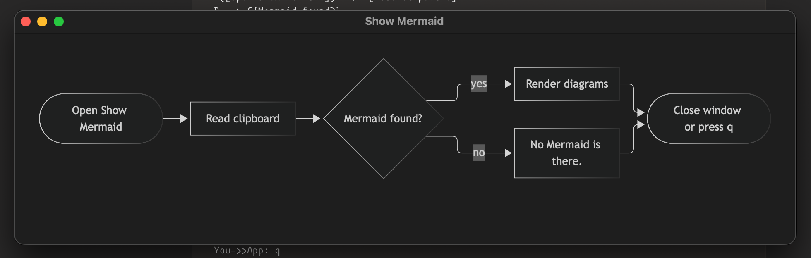

# Show Mermaid

A small macOS app that renders the Mermaid diagrams on your clipboard when you open it. Closing the window, or pressing `q` / `⌘Q`, quits the app.



To try it, copy the contents of [`docs/example.md`](docs/example.md) and open the app.

- It renders every ```` ```mermaid ```` fenced block in the clipboard text. If there are no fenced blocks, it treats the whole clipboard as a diagram, as long as it begins with a Mermaid keyword (`flowchart`, `sequenceDiagram`, …).
- If nothing matches, the window shows "No Mermaid is there."
- Mermaid is bundled at `Vendor/mermaid.min.js` (v12.0.0), so the app works offline.

```sh
./build.sh            # → build/Show Mermaid.app
./build.sh --install  # also copies it to ~/Applications
```

The icon is `Support/AppIcon.svg` (the Mermaid logo). `Support/AppIcon.icns` is generated from it with `rsvg-convert` and `iconutil`.

Requires macOS 14+ and the Xcode toolchain.
