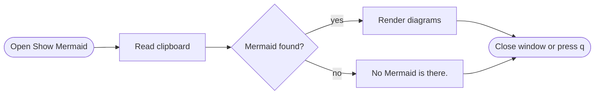

```mermaid
flowchart LR
  A([Open Show Mermaid]) --> B[Read clipboard]
  B --> C{Mermaid found?}
  C -- yes --> D[Render diagrams]
  C -- no --> E[No Mermaid is there.]
  D --> F([Close window or press q])
  E --> F
```
